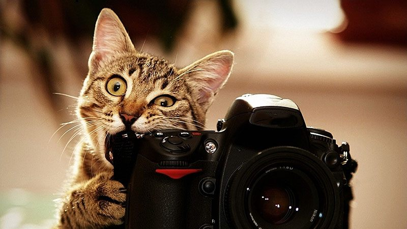

# PetFinder.my - Pawpularity Contest

I tried to create an accurate machine learning models capable of analyzing raw images and metadata to predict the “Pawpularity” of pet photos. This model will offer accurate recommendations that will improve animal welfare. For this task, i used efficient net and xgboost, and Streamlit to create a web app for this task. This solution could be adapted into AI tools that will guide shelters and rescuers around the world to improve the appeal of their pet profiles, automatically enhancing photo quality and recommending composition improvements. As a result, stray dogs and cats can find their "furever" homes much faster

 

### Connect with me:

  <a href="https://www.linkedin.com/in/taha-tamir-351272145/" rel="nofollow noreferrer">
     LinkedIn
  </a> &nbsp;
 

 dir
